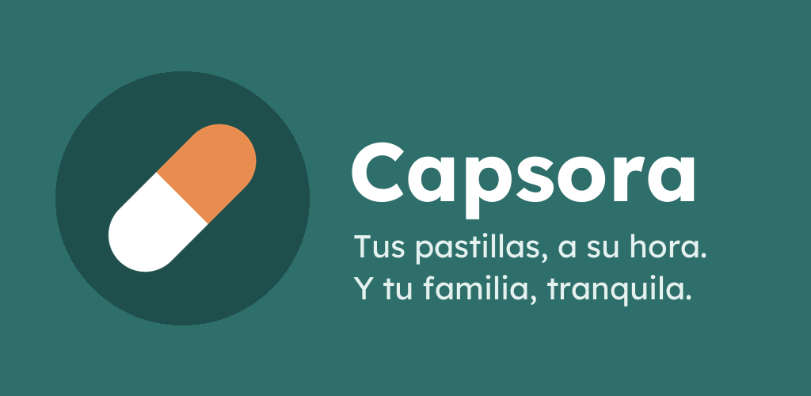
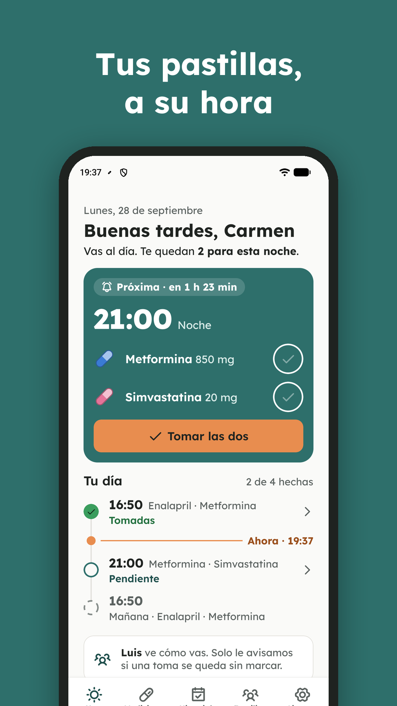
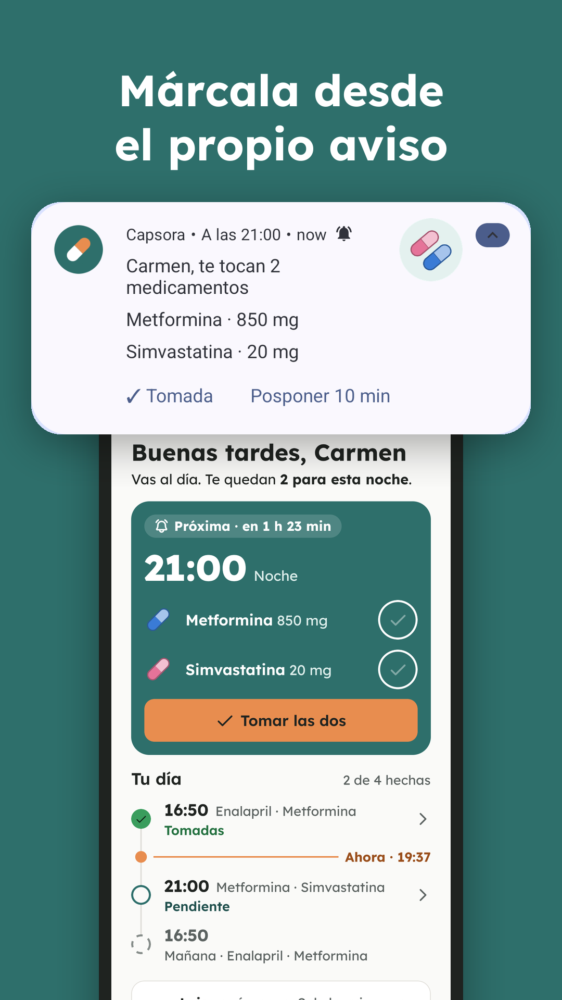
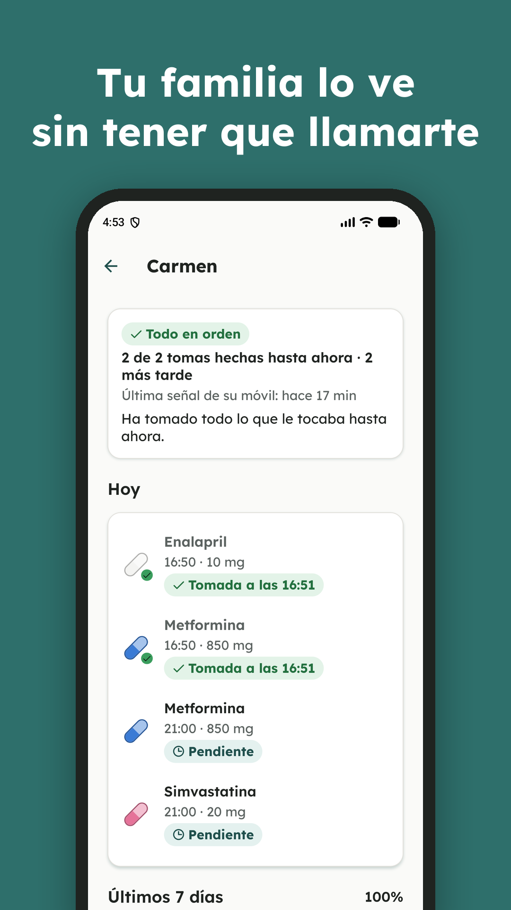
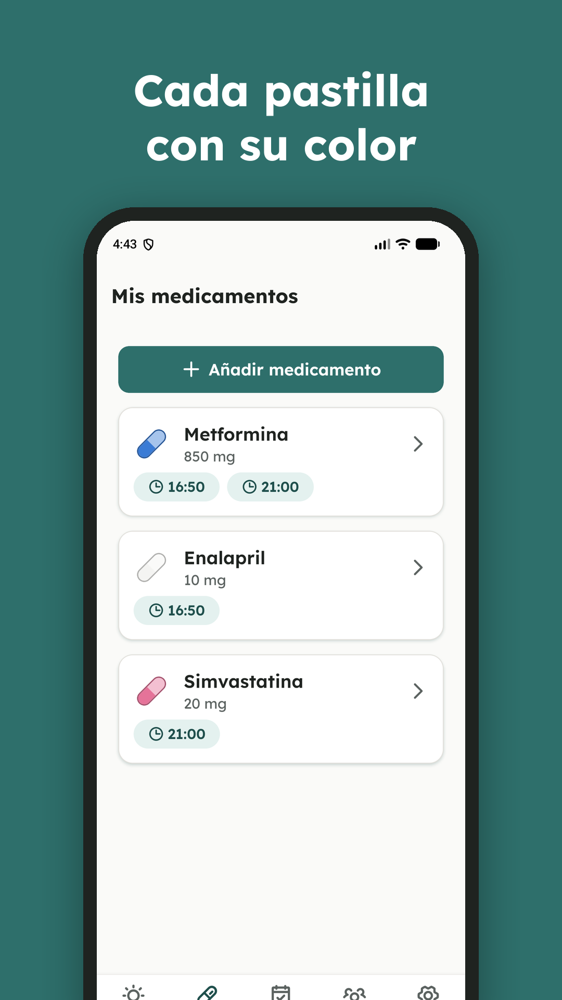
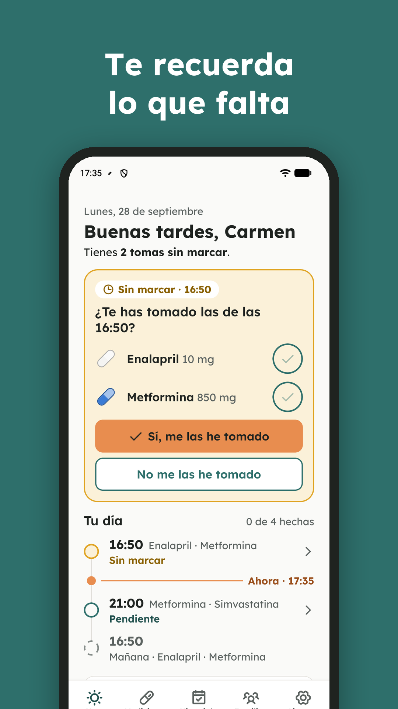

<p align="center">
  
</p>

# Capsora

**Medication reminders that ring on time, with a read-only caregiver mode.** An Android app built with React Native
and Supabase, designed for older adults and the relatives who look after them.

> **Status: beta, parked.** Capsora works end to end and was tested for days on a real Xiaomi phone, but it is not on
> Google Play: since 2026 Google only accepts medication-management apps from organization accounts, and this is a
> personal project. You can [download the APK](https://github.com/trujidevv/capsora/releases/latest) and install it
> directly. The app is in Spanish. *Resumen en español: [capsora.es](https://capsora.es) y la
> [guía de desarrollo](docs/DESARROLLO.md).*

<p align="center">
  
  
  
  
  
</p>

## What it does

- **Exact-time reminders**, like an alarm clock, even with the phone locked, the app closed or no internet. Doses at
  the same time are grouped into one notification with **Taken** and **Snooze 10 min** buttons that work without
  opening the app, a custom sound and the pill's color.
- **Today screen** built around one question, *what do I take now?*: a large card with the next dose (or "it's time",
  or "did you take it?" once it's late), one tap to mark one pill or all of them, and the whole day on a timeline.
- **Caregiver mode**: the patient shares an 8-character code and one relative gets **read-only** access to today and
  the last 7 days. The relative is only notified when a dose stays unconfirmed for an hour, never for doses taken on
  time. If the patient's phone stops reporting, the caregiver sees *"We can't confirm"* instead of *"missed"*.
- **Reliability assistant**: step-by-step fixes for the battery savers of Xiaomi, Samsung, Huawei, OPPO and vivo, plus
  a test notification.
- **History** with a 5-week traffic-light calendar, adherence percentages and corrections for the past 7 days.
- **Accessible by default**: text ≥ 16 px, touch targets ≥ 48 px, light and dark themes, WCAG AA contrast checked by
  tests, screen-reader labels and reduced-motion support.
- **Your data is yours**: free CSV export, account deletion from the app, EU servers, no ads and no tracking.
- It **only reminds and records**: no dosage advice, no drug interactions, no diagnosis.

## Tech stack

| Area | Tools |
|---|---|
| App | React Native 0.87 (new architecture), TypeScript, React Navigation 7, Reanimated 4 |
| Backend | Supabase: Postgres with row-level security on every table, Auth (email and Google), Edge Functions, `pg_cron` |
| Notifications | `react-native-notify-kit` (Notifee fork) with `AlarmManager` exact alarms; Firebase Cloud Messaging for caregiver alerts |
| Quality | Jest (225 tests), ESLint, Prettier, Firebase Crashlytics without personal data |
| Web | Astro + Tailwind on Cloudflare Pages ([capsora.es](https://capsora.es), separate repository) |

## How it works

```
src/
├── logic/          Pure TypeScript, no React or native code, fully unit-tested:
│                   dates, dose states, the notification planner, the Today screen rules, CSV, contrast
├── data/           Every Supabase query lives here (screens never call Supabase directly)
├── notificaciones/ Scheduling, notification actions with the app killed, reliability checks, channels
├── lib/            Contexts (auth, data, reliability, theme), local storage, offline queue
├── components/     UI pieces (Today card, day timeline, pill capsule, buttons…)
└── screens/        One file per screen
supabase/
├── migrations/     Numbered SQL: schema, RLS policies, caregiver alerts, account deletion, usage views
└── functions/      Edge Function that pushes caregiver alerts through FCM (called by pg_cron every 5 min)
```

Some decisions worth a look:

- **Idempotent notification sync.** The planner turns the medication schedule into the next 7 days of notifications,
  each one with a content signature. Syncing compares signatures and only reschedules what changed, so it can run on
  every app open, data change or notification action without duplicating alarms.
- **Offline first.** Marking a dose writes locally first (so its reminders are cancelled right away), then goes to
  Supabase or to a queue that is flushed when the connection comes back.
- **Caregiver alerts on the server.** A `pg_cron` job finds doses that are still unconfirmed 60 minutes after their
  time, in the patient's time zone, and an Edge Function sends one push per dose time. A heartbeat from the patient's
  phone decides between "missed" and "we can't confirm".
- **Security in the database, not the app.** Row-level security guarantees that a caregiver can read, and only read,
  the data of the person who invited them. Policies were tested with four roles: owner, caregiver, stranger and
  anonymous.
- **Generated assets.** The notification sound (a low marimba) is synthesized with NumPy, and the pill images for the
  notifications, the store screenshots and the icon are drawn by Python scripts in [`scripts/`](scripts).

## Things I learned the hard way

- **Android phones kill reminders.** Exact alarms are not enough on Xiaomi or Samsung. The fix was
  `SET_ALARM_CLOCK` alarms, handling notification actions in a headless task, and a guided checklist for each brand.
- **Time zones are sneaky.** An emulator reporting `GMT` made caregiver alerts arrive two hours late. Only real IANA
  zones are saved now.
- **Store policy is part of the product.** The app passed every technical step of Google Play and was rejected for the
  account type. Checking distribution rules before building saves weeks.

## Running it

Setup instructions (Supabase, Firebase, Google sign-in, signing) are in Spanish in
[`docs/DESARROLLO.md`](docs/DESARROLLO.md). In short:

```bash
npm install
cp .env.example .env   # SUPABASE_URL, SUPABASE_ANON_KEY and, optionally, GOOGLE_WEB_CLIENT_ID
npx react-native run-android
npm test
```

## License

© 2026 Sergio Trujillo. All rights reserved. The code is public so it can be read as a portfolio project; please ask
before reusing it. Capsora is not a medical device and does not replace advice from a doctor or pharmacist.
